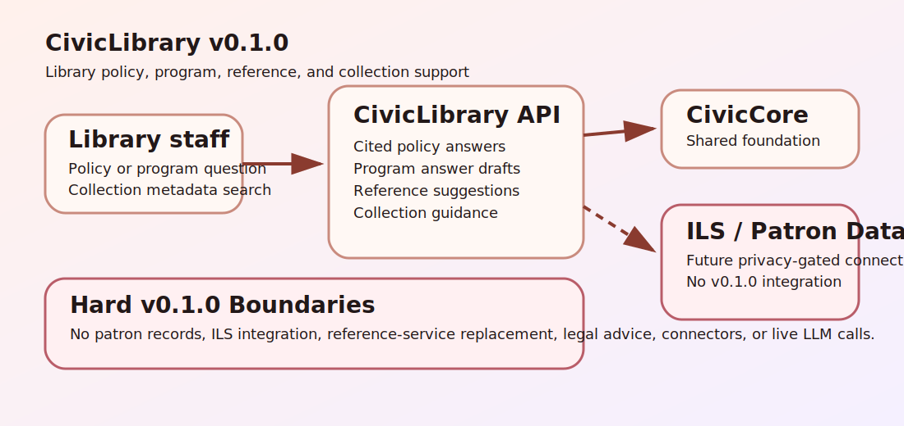

# CivicLibrary User Manual

## Non-Technical Staff

CivicLibrary helps library staff prepare cited policy answers, answer program and event questions, search collection metadata, and draft collection-development guidance.

Librarians remain responsible for every answer, reference result, and collection guidance note. CivicLibrary does not access patron records, connect to an ILS, manage circulation, place holds, assess fines, replace professional reference service, or replace library systems of record.

## IT / Technical

Install with:

```bash
python -m pip install -e ".[dev]"
python -m uvicorn civiclibrary.main:app --host 127.0.0.1 --port 8143
```

Runtime dependency: `civiccore==0.2.0`.

Primary endpoints:

- `GET /health` - service and CivicCore version.
- `GET /civiclibrary` - public sample UI.
- `POST /api/v1/civiclibrary/policy-answer` - cited library policy answer draft.
- `POST /api/v1/civiclibrary/program-answer` - program and event answer draft.
- `POST /api/v1/civiclibrary/reference-search` - collection-metadata reference search.
- `POST /api/v1/civiclibrary/collection-guidance` - collection-development guidance draft.

## Architecture



CivicLibrary is a module on top of CivicCore. v0.1.0 is deterministic and local: no patron-record access, circulation actions, holds, fines, ILS replacement, live LLM calls, or connector runtime is shipped.
